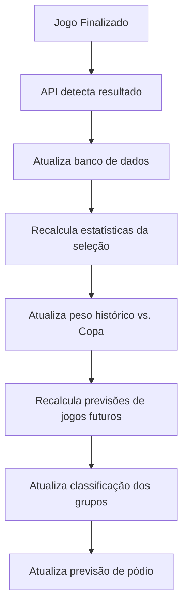

# 🔄 Sistema Adaptativo de Previsões

## Visão Geral

O **Sistema Adaptativo** é o grande diferencial deste projeto. Ele permite que as previsões sejam **atualizadas dinamicamente** conforme os jogos da Copa 2026 acontecem, tornando os palpites cada vez mais precisos.

## Como Funciona

### 1. Atualização Automática de Resultados

O sistema monitora continuamente os resultados dos jogos através da API-Football:

```python
# Atualização manual
python src/live_updater.py

# Monitoramento contínuo (atualiza a cada 5 minutos)
python src/live_updater.py monitor
```

**O que acontece:**
- ✅ Busca resultados finalizados na API
- ✅ Atualiza banco de dados com placares reais
- ✅ Registra timestamp da atualização
- ✅ Mantém histórico completo

### 2. Recálculo Dinâmico de Previsões

Após cada atualização de resultados, o sistema **recalcula automaticamente** as previsões:

#### Ponderação Adaptativa

```
Previsão Final = (Peso_Histórico × Dados_Históricos) + (Peso_Copa × Performance_Copa_2026)
```

**Pesos dinâmicos:**
- **Início da Copa** (0 jogos): 100% histórico, 0% Copa
- **Após 1 jogo**: 85% histórico, 15% Copa
- **Após 3 jogos**: 55% histórico, 45% Copa
- **Após 5+ jogos**: 40% histórico, 60% Copa

#### Fórmula de Peso

```python
peso_copa = min(0.60, num_jogos_copa * 0.15)
peso_historico = 1 - peso_copa
```

### 3. Exemplo Prático

**Cenário: Brasil vs. Argentina**

#### Antes da Copa
```
Previsão baseada em:
- Histórico geral (últimos 5 anos)
- Forma recente (últimos 10 jogos)
- Rankings FIFA/ELO

Resultado: Brasil 2 x 1 Argentina
Confiança: 65%
```

#### Após Brasil jogar 3 partidas na Copa
```
Previsão baseada em:
- 55% Histórico geral
- 45% Performance na Copa 2026

Se Brasil marcou média de 3 gols/jogo na Copa:
Resultado ajustado: Brasil 3 x 1 Argentina
Confiança: 72%
```

## Fluxo de Atualização



## Componentes do Sistema

### 1. LiveUpdater (`live_updater.py`)

**Responsabilidades:**
- Monitorar jogos em tempo real
- Buscar resultados finalizados
- Atualizar banco de dados
- Detectar jogos ao vivo

**Métodos principais:**
```python
updater = LiveUpdater()

# Atualizar jogos de hoje
updater.update_all_matches()

# Monitorar continuamente
updater.monitor_matches(interval_minutes=5)

# Verificar jogos ao vivo
live_matches = updater.get_live_matches()
```

### 2. AdaptiveMatchPredictor (`adaptive_model.py`)

**Responsabilidades:**
- Calcular performance na Copa 2026
- Ponderar histórico vs. Copa
- Gerar previsões adaptativas

**Métodos principais:**
```python
predictor = AdaptiveMatchPredictor()

# Atualizar performance
predictor.update_copa_performance()

# Prever jogo (adaptativo)
prediction = predictor.predict_match_score_adaptive(home_id, away_id)
```

### 3. AdaptiveGroupPredictor (`adaptive_model.py`)

**Responsabilidades:**
- Considerar jogos já realizados no grupo
- Prever apenas jogos futuros
- Calcular classificação final

**Lógica:**
```python
# Para cada grupo:
1. Buscar jogos já finalizados
2. Aplicar resultados reais
3. Prever jogos restantes (adaptativo)
4. Calcular classificação final
```

### 4. AdaptivePodiumPredictor (`adaptive_model.py`)

**Responsabilidades:**
- Considerar classificados reais dos grupos
- Simular mata-mata com previsões adaptativas
- Calcular probabilidades de pódio

## Vantagens do Sistema Adaptativo

### 1. Precisão Crescente
- Quanto mais jogos acontecem, mais precisas ficam as previsões
- Sistema "aprende" com a performance real das seleções

### 2. Reação a Surpresas
- Se uma seleção favorita perde jogos, o sistema ajusta automaticamente
- Se um azarão surpreende, suas chances aumentam nas próximas previsões

### 3. Contexto da Copa
- Performance em Copa do Mundo pode ser diferente de jogos amistosos
- Sistema captura essa diferença automaticamente

### 4. Transparência
- Dashboard mostra claramente se previsão é adaptativa
- Indica quantos jogos da Copa foram considerados
- Exibe pesos usados no cálculo

## Configurações Avançadas

### Ajustar Taxa de Adaptação

Em `adaptive_model.py`:

```python
# Mais conservador (adapta mais devagar)
copa_weight = min(0.50, copa_perf["matches"] * 0.10)

# Mais agressivo (adapta mais rápido)
copa_weight = min(0.80, copa_perf["matches"] * 0.20)
```

### Ajustar Intervalo de Monitoramento

```python
# Verificar a cada 1 minuto (mais frequente)
updater.monitor_matches(interval_minutes=1)

# Verificar a cada 15 minutos (menos frequente)
updater.monitor_matches(interval_minutes=15)
```

## Uso no Dashboard

O dashboard Streamlit detecta automaticamente se as previsões são adaptativas:

```python
if prediction["adaptation_info"]["is_adapted"]:
    st.info(
        "✅ Previsão Adaptativa: Considera resultados reais da Copa 2026"
    )
```

## Limitações

### 1. Primeiros Jogos
- No início da Copa, sistema depende mais do histórico
- Previsões podem ser menos precisas para azarões

### 2. Dependência da API
- Requer conexão com API-Football
- Sujeito a limites de requisições

### 3. Aleatoriedade do Futebol
- Mesmo com adaptação, resultados inesperados acontecem
- Sistema não pode prever lesões, expulsões, etc.

## Roadmap de Melhorias

- [ ] Integração com múltiplas APIs (redundância)
- [ ] Análise de jogadores-chave (artilheiros, lesões)
- [ ] Consideração de cartões (suspensões)
- [ ] Machine Learning avançado (XGBoost, Neural Networks)
- [ ] Análise de sentimento (notícias, redes sociais)
- [ ] Backtesting com Copas anteriores

## Conclusão

O **Sistema Adaptativo** transforma este projeto de uma simples calculadora de previsões em um **sistema inteligente** que evolui junto com a Copa 2026, oferecendo palpites cada vez mais precisos e contextualizados.
